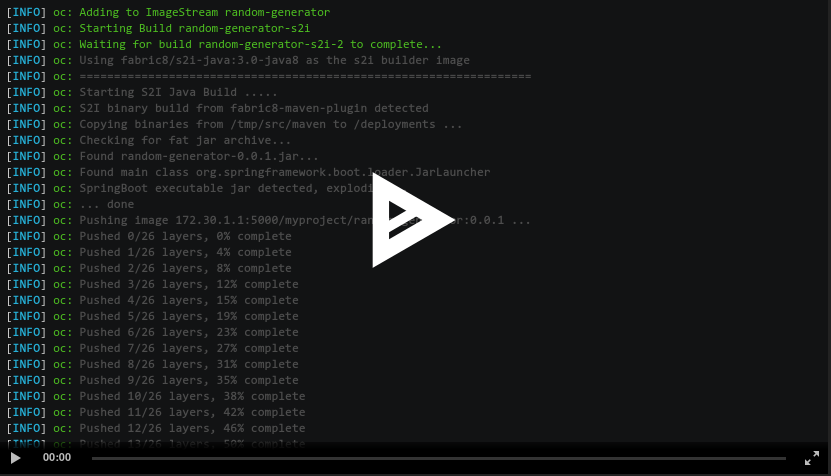

# Eclipse JKube
> Cloud-Native Java Applications without a hassle

[](https://circleci.com/gh/eclipse/jkube/tree/master)
[](https://github.com/eclipse/jkube/actions?query=branch%3Amaster)
[](https://sonarcloud.io/dashboard?id=jkubeio_jkube)
[](https://sonarcloud.io/dashboard?id=jkubeio_jkube)
[](https://gitter.im/eclipse/jkube?utm_source=badge&utm_medium=badge&utm_campaign=pr-badge)
[](https://twitter.com/jkubeio)
[](https://katacoda.com/jkubeio)

<p align="center">
  <a href="https://www.eclipse.org/jkube/">
    
  </a>
</p>

## Rebranding Notice :loudspeaker:

This project is not an effort from scratch. It was earlier called
[Fabric8 Maven Plugin](https://github.com/fabric8io/fabric8-maven-plugin).
It is just refactored and rebranded version of the project targeted towards Java developers who are working on top of
Kubernetes. For more information about history, please see [REBRANDING.md](./REBRANDING.md)

## Introduction

Eclipse JKube is a collection of plugins and libraries that are used for building container images using Docker, JIB or
S2I build strategies. Eclipse JKube generates and deploys Kubernetes/OpenShift manifests at compile time too.

It brings your Java applications on to Kubernetes and OpenShift by leveraging the tasks required to make your
application cloud-native.

Eclipse JKube also provides a set of tools such as watch, debug, log, etc. to improve your developer experience.
This project contains various building blocks for the Kubernetes Java developer toolbox.


### Kubernetes Maven Plugin
[](https://search.maven.org/search?q=g:%22org.eclipse.jkube%22%20AND%20a:%22kubernetes-maven-plugin%22)
[](https://www.eclipse.org/jkube/docs/kubernetes-maven-plugin)

[](https://asciinema.org/a/335724)

### OpenShift Maven Plugin
[](https://search.maven.org/search?q=g:%22org.eclipse.jkube%22%20AND%20a:%22openshift-maven-plugin%22)
[](https://www.eclipse.org/jkube/docs/openshift-maven-plugin)

[](https://asciinema.org/a/335743)

### JKube Kit

JKube Kit is the core engine powering our Maven plugins.

The main difference between Fabric8 Maven Plugin and JKube is the extraction and decoupling of the core components from
Maven. This enables other projects and frameworks to reuse all of JKube's functionality by exposing it through a public API.

  * **Generator** framework for automatically generating Docker images by examining project information.<br />
  [](https://search.maven.org/search?q=g:%22org.eclipse.jkube%22%20AND%20a:%22jkube-kit-generator-api%22) [](http://www.javadoc.io/doc/org.eclipse.jkube/jkube-kit-generator-api)
  * **Enricher** framework for creating and enhancing Kubernetes and OpenShift resources.<br />
  [](https://search.maven.org/search?q=g:%22org.eclipse.jkube%22%20AND%20a:%22jkube-kit-enricher-api%22) [](http://www.javadoc.io/doc/org.eclipse.jkube/jkube-kit-enricher-api)
  * **Profile** combining the configuration for generators and enrichers.<br />
  [](https://search.maven.org/search?q=g:%22org.eclipse.jkube%22%20AND%20a:%22jkube-kit-profiles%22) [](http://www.javadoc.io/doc/org.eclipse.jkube/jkube-kit-profiles)
  * **Resource configuration** model objects for a simplified configuration of Kubernetes and OpenShift resources.<br />
  [](https://search.maven.org/search?q=g:%22org.eclipse.jkube%22%20AND%20a:%22jkube-kit-config-resource%22) [](http://www.javadoc.io/doc/org.eclipse.jkube/jkube-kit-config-resource)
  * **Image configuration** model objects for modeling Docker image configuration as used in docker-maven-plugin.<br />
  [](https://search.maven.org/search?q=g:%22org.eclipse.jkube%22%20AND%20a:%22jkube-kit-config-image%22) [](http://www.javadoc.io/doc/org.eclipse.jkube/jkube-kit-config-image)

Some thin adapter Maven specific modules like [jkube-kit-enricher-maven](enricher/maven/pom.xml) and
[jkube-kit-generator-maven](generator/maven/pom.xml) are provided as glue to get to the Maven specific build information
 like the project's coordinates.

## Getting started

Check out our [Maven quickstarts](https://github.com/eclipse/jkube/tree/master/quickstarts/maven) to see how JKube fits
with the Java framework of your choice.https://github.com/eclipse/jkube/tree/master/quickstarts/maven

### Hello World using Eclipse JKube

- Clone repository and move to quickstart [helloworld](https://github.com/eclipse/jkube/tree/master/quickstarts/maven/hello-world) sample, build project and run JKube goals:
```shell script
# 1. Clone repository 
$ git clone git@github.com:eclipse/jkube.git 
 
# 2. Move to Hello World Quickstart folder
$ cd jkube/quickstarts/maven/hello-world

# 3. Build Project and run JKube goals
$ mvn clean install                                                            \
  k8s:build         `# Build Docker Image`                                     \
  k8s:resource      `# Generate Kubernetes Manifests`                          \
  k8s:apply         `# Apply generated Kubernetes Manifests onto Kubernetes`
```
- Check created pod logs:
```shell script
# Using Kubectl
$ kubectl get pods
NAME                                       READY   STATUS        RESTARTS   AGE
helloworld-7c4665f464-xwskj                0/1     Completed     2          27s
$ kubectl logs jkube-sample-helloworld-7c4665f464-xwskj
Hello World!
# Using JKube
$ mvn k8s:log
[INFO] k8s:  [NEW] helloworld-7c4665f464-xwskj status: Running 
[INFO] k8s:  [NEW] Tailing log of pod: helloworld-587dfff745-2kdpq
[INFO] k8s:  [NEW] Press Ctrl-C to stop tailing the log
[INFO] k8s:  [NEW] 
[INFO] k8s: Hello World!
[INFO] k8s:  [NEW] helloworld-7c4665f464-xwskj status: Running 
```

## Troubleshooting

If you experience problems using minikube that pod's status shows 'ImagePullBackOff' and not 'Completed' you must share the minikube's docker daemon environment with your shell with:
```shell script
$ eval $(minikube docker-env)
```
You can remove this from your shell again with:
```shell script
$ eval $(minikube docker-env -u)
````
If you don't want to type the command for every new terminal you open, you can add the command to your `.bash_profile`
on mac or `.zshrc`.
