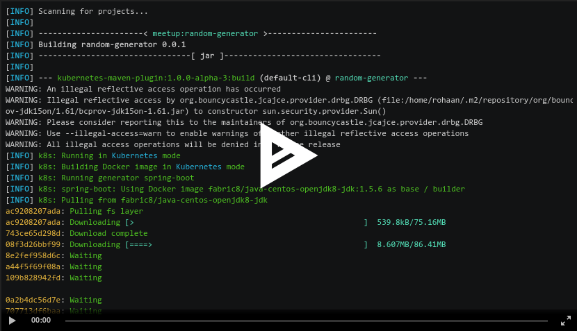

## Kubernetes Maven Plugin

[](https://search.maven.org/search?q=g:%22org.eclipse.jkube%22%20AND%20a:%22kubernetes-maven-plugin%22)

[](https://asciinema.org/a/335724)

### Introduction
This Maven plugin is a one-stop-shop for building and deploying Java applications for Docker, Kubernetes. It brings your Java applications on to Kubernetes. It provides a tight integration into maven and benefits from the build configuration already provided. It focuses on three tasks:
+ Building Docker images
+ Creating Kubernetes resources
+ Deploy applications

### Usage
To enable kubernetes maven plugin on your project just add this to the plugins sections of your pom.xml:

```
      <plugin>
        <groupId>org.eclipse.jkube</groupId>
        <artifactId>k8s-maven-plugin</artifactId>
        <version>${jkube.kubernetes.version}</version>
      </plugin>
```

| Goal                                          | Description                           |
| --------------------------------------------- | ------------------------------------- |
| [`k8s:resource`](https://www.eclipse.org/jkube/docs/kubernetes-maven-plugin#k8s:resource) | Create Kubernetes resource descriptors |
| [`k8s:build`](https://www.eclipse.org/jkube/docs/kubernetes-maven-plugin#k8s:build) | Build Docker images |
| [`k8s:push`](https://www.eclipse.org/jkube/docs/kubernetes-maven-plugin#k8s:push) | Push Docker images to a registry  |
| [`k8s:deploy`](https://www.eclipse.org/jkube/docs/kubernetes-maven-plugin#k8s:deploy) | Deploy Kubernetes resource objects to a cluster  |
| [`k8s:watch`](https://www.eclipse.org/jkube/docs/kubernetes-maven-plugin#k8s:watch) | Watch for doing rebuilds and restarts |

### Features

* Dealing with Docker images and hence inherits its flexible and powerful configuration.
* Supports Kubernetes descriptors
* Various configuration styles:
  * **Zero Configuration** for a quick ramp-up where opinionated defaults will be pre-selected.
  * **Inline Configuration** within the plugin configuration in an XML syntax.
  * **External Configuration** templates of the real deployment descriptors which are enriched by the plugin.
* Flexible customization:
  * **Generators** analyze the Maven build and generated automatic Docker image configurations for certain systems (spring-boot, plain java, karaf ...)
  * **Enrichers** extend the Kubernetes resource descriptors by extra information like SCM labels and can add default objects like Services.
  * Generators and Enrichers can be individually configured and combined into *profiles*

### Kubernetes Compatibility

:heavy_check_mark: : Supported, all available features can be used

:x: : Not supported at all

:large_blue_circle: : Supported, but not all features can be used

##### Kubernetes

| KMP               | Kubernetes 1.19.0  | Kubernetes 1.18.0  | Kubernetes 1.17.0  | Kubernetes 1.12.0  |
|-------------------|--------------------|--------------------|--------------------|--------------------|
| KMP 1.0.1         | :heavy_check_mark: | :heavy_check_mark: | :heavy_check_mark: | :heavy_check_mark: |
| KMP 1.0.0         | :heavy_check_mark: | :heavy_check_mark: | :heavy_check_mark: | :heavy_check_mark: |
| KMP 0.2.0         |                    |                    | :heavy_check_mark: | :heavy_check_mark: |
| KMP 0.1.1         |                    |                    | :x:                | :heavy_check_mark: |
| KMP 0.1.0         |                    |                    | :x:                | :heavy_check_mark: |
