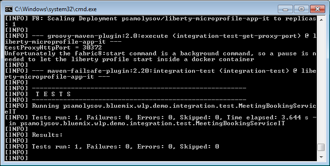

## A WebSphere Liberty Java EE 8 based application prepared for development using Eclipse Jkube Kubernetes Maven Plugin

**WebSphere Liberty** is a fast, dynamic, and easy-to-use Java application server, built on the open source 
[Open Liberty][openliberty] project. Ideal for developers but also ready for production, on-premise or in the cloud.

### The application structure

The demo application is divided into two modules:
 1. *javaee8-webprofile-liberty-app* - a web-application, which leverages Java EE 8 WebProfile and exposes a JAR-RS based RESTful 
 web-service. The application also contains a Java servlet that puts into the output stream the information about on which JVM it 
 works. This information will be important when we try to publish the application on different JVMs within the cloud platform.

 1. *javaee8-webprofile-liberty-app-it* - a set of integration tests for the application. The *[kubernetes maven plugin][k-m-p]* is
 leveraged to deploy the application on a WebSphere Liberty based docker container running inside a Kubernetes cluster and run 
 the integration tests dependent on the containerized application. 


### Deploy the application on a Kubernetes cluster

The demo application uses the *[Kubernetes maven plugin][k-m-p]* as an access point to Kubernetes: the application can be deployed on a 
WebSphere Liberty based docker container running inside a Kubernetes cluster and the integration tests run dependent on the containerized
application.

To run the integration tests do the following commands:


1. If you use *[minikube]*, the cluster must be started. To start the cluster use the following command:

```
# minikube start
```

If you prefer *[minishift]*, start the OpenShift implementation and specify the driver using the bellow command
(`virtualbox` is just an example):

```
# minishift start --vm-driver virtualbox
```
                        
2. All environment variables must be set before using this plugin, see the instruction generated by:

```
# gofabric8 docker-env
```  

4. **(OpenShift only)** Allow this project to run as root using the below commands to change the security context constraints:

```
# oc new-project jkube

# oc edit scc anyuid
```

The last command opens a text editor where the definition of the *scc* appears. The following paragraph must be placed there
just before `volumes:`

```yaml
users:
- system:serviceaccount:jkube:default
```

The result will looks like bellow:

```yaml
users:
- system:serviceaccount:jkube:default
volumes:
- configMap
- downwardAPI
- emptyDir
- persistentVolumeClaim
- projected
- secret
```

Save the changes and close the editor.

The detailed information about how to allow using a root user within the container could be found here: [Getting any Docker image 
running in your own OpenShift cluster][allow-using-a-root-user].

5. Build a docker image for `javaee8-webprofile-liberty-app`, deploy the image to Kubernetes and run the integration tests:

```
# cd jkube/quickstarts/maven/javaee8-webprofile-liberty

# mvn clean verify -DtestProxyHost=192.168.99.100
```

(if you are running the *minikube* or *minishift* virtual machine on *VirtualBox*, `-DtestProxyHost=192.168.99.100` helps you
specify the virtual machine host. If the integration test fails with `error 404`, just try to increase the value of the `startPodPause`
property in the [`javaee8-webprofile-liberty-app-it/pom.xml`](javaee8-webprofile-liberty-app-it/pom.xml) file. The `start` goal is 
background and a pause is needed to let the Liberty profile start inside the docker container.)

P.S. the `kubernetes-maven-plugin` isn't able to generate a value of the `nodePort` parameter for exposed services, so a Kubernetes 
implementation generates a new port number for the service after each execution of the `k8s:apply` goal. 
The [`org.codehaus.gmaven:groovy-maven-plugin`][groovy-maven-plugin] is used to get the dynamic bound `nodePort` value for the 
container with the demo application:

```xml
<plugin>
    <!-- how to get the dynamic bound nodePort for the container in the kubernetes cluster
         idea: https://stackoverflow.com/questions/13887436/maven-exec-bash-script-and-save-output-as-property
         kubectl must be declared in $PATH
    -->
    <groupId>org.codehaus.gmaven</groupId>
    <artifactId>groovy-maven-plugin</artifactId>
    <executions>
        <execution>
            <id>integration-test-get-proxy-port</id>
            <phase>pre-integration-test</phase>
            <goals>
                <goal>execute</goal>
            </goals>
            <configuration>
                <properties>
                    <script>kubectl get service ${applicationArtifactId} -n ${docker.user} -o jsonpath="{.spec.ports[0].nodePort}"</script>
                    <pause>${startPodPause}</pause>
                </properties>
                <source>
                    def pause = properties.pause as Integer             
                    def command = properties.script
                    def process = command.execute()
                    def outputStream = new StringBuffer()
                    process.waitForProcessOutput(outputStream, System.err)
                    def port = outputStream.toString().replace("\"", "").trim()
                    println "testProxyHttpPort = " + port
                    project.properties.testProxyHttpPort = port
                    Thread.sleep(pause)
                </source>
            </configuration>
        </execution>
    </executions>
</plugin>
```

(The `kubectl` program must be declared in the environment variable `$PATH`.)



[openliberty]: http://openliberty.io/
[k-m-p]: https://www.eclipse.org/jkube
[minikube]: https://github.com/kubernetes/minikube
[minishift]: https://www.openshift.org/minishift/
[groovy-maven-plugin]: https://groovy.github.io/gmaven/groovy-maven-plugin/
[allow-using-a-root-user]: https://blog.openshift.com/getting-any-docker-image-running-in-your-own-openshift-cluster/
