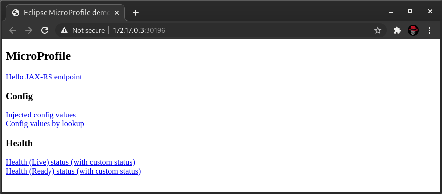
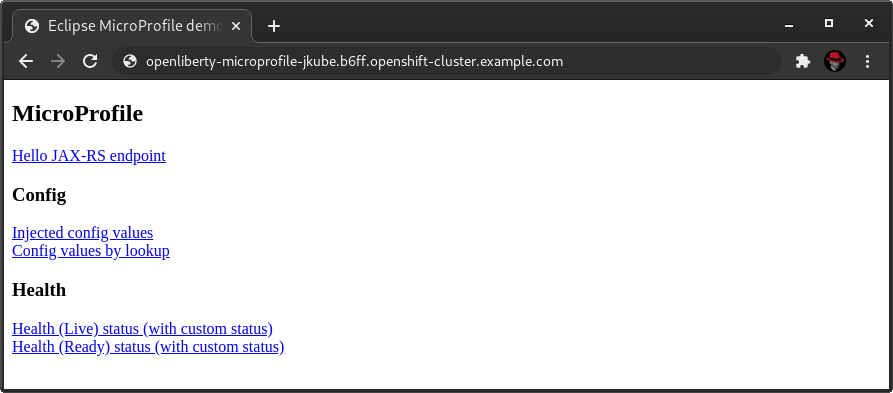

# Eclipse JKube OpenLiberty MicroProfile Quickstart

This example shows how to integrate Eclipse JKube in an OpenLiberty-MicroProfile application as downloaded from
[start.microprofile.io](https://start.microprofile.io).

```shell script
$ curl -O -J 'https://start.microprofile.io/api/project?supportedServer=LIBERTY&mpVersion=MP33&selectedSpecs=CONFIG&selectedSpecs=HEALTH_CHECKS'
```

Includes a JAX-RS REST endpoint, CDI injected configuration and healthchecks as provided by
[MicroProfile Health](https://github.com/eclipse/microprofile-health).


## Requirements

- JDK 1.8+
- Kubernetes Cluster (Minikube, OpenShift, CRC, etc.)

## Building and deploying the application

If running on Minikube, share your cluster's Docker daemon first:
```shell script
$ eval $(minikube docker-env)
```

```shell script
# Kubernetes
$ mvn clean package -Pkubernetes k8s:deploy
# OpenShift
$ mvn clean package -Popenshift oc:deploy
```

## Expected output

Once you've deployed the application _(please allow 1 minute for the application to start)_, you should be able to do the following:

### Minikube

```shell script
$ minikube service openliberty-microprofile
```

A browser window should open with the following content:



You should now be able to check the exposed links.

### OpenShift

Get the automatically created Route for your application:

```shell script
$ oc get routes.route.openshift.io openliberty-microprofile -o jsonpath='{.spec.host}
openliberty-microprofile-jkube.b6ff.openshift-cluster.example.com
```

Open the returned URL in your preferred browser:



You should now be able to check the exposed links.